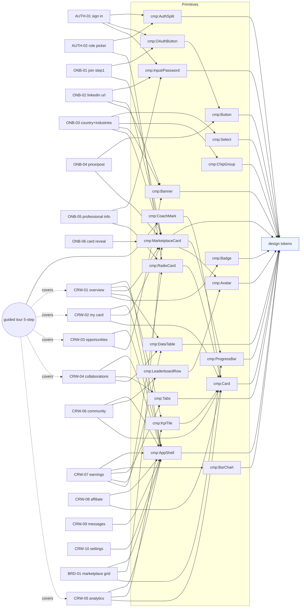

# Naano — Project Notes & Spec Recovery

> Living document. Sources: (1) walkthrough video `Video Project 10.mp4` (193 s, 1920×1080),
> (2) 24 UI/UX design screenshots pasted 2026-09-10, (3) live naano.com.
> Started: 2026-09-10 · Owner: aranyabandhu2004@gmail.com
> Goal (updated 2026-09-10): **build the creator-side app** exactly as shown in the video + screenshots.
> There is **no admin panel** and no separate brand app to build — only `BRD-01` (the marketplace grid) is in scope.

## 0. How to use this doc
- Every screen has a **stable ID** (e.g. `CRW-05`). Referenced by the change-impact graph (§6) and `agents.md`.
- Each screen block: **Observed** → **Current (repo)** → **Gap** → **Tasks**.
- Video timestamps: `vid @m:ss`. Frames live in `docs/frames/` (regenerate with `scripts/extract-frames.py`).

## 1. Sources / assets
| Source | Location | Notes |
|---|---|---|
| Walkthrough video | `C:\Users\User\Downloads\Video Project 10.mp4` | 193 s @ 30 fps, 1920×1080. Creator-side only; no brand/admin. |
| Design screenshots | pasted in chat 2026-09-10 | 24 images, ~2200–2560 px wide. Authoritative for the app. |
| Extracted frames | `docs/frames/` (`_sheet_00/01.png` contact sheets) | 2 s sampling; `docs/frames/signin/` = 1 s over the auth segment |
| Live site | https://naano.com | marketing pages + `naano.com/lp/*` image assets |

## 2. Video timeline (what the walkthrough covers)
| vid | Area | Screen |
|---|---|---|
| 0:00–0:54 | Marketing | homepage top→bottom: hero, trust bar, marketplace section, 5-step "Run creator campaigns", testimonial, stats, pricing, FAQ, CTA, footer |
| 0:56–1:03 | Auth | **Welcome back** (sign in) — split screen |
| ~1:04 | Auth | "Continue with LinkedIn" → real **LinkedIn OAuth** page |
| 1:06–1:14 | Auth | **Create your account** — role picker (creator / brand) |
| 1:16–1:20 | Onboarding | **Join Naano — Step 1/4** (LinkedIn / Google / email sign-up) |
| 1:20–1:26 | Onboarding | **Step 2/4 — Add your public LinkedIn profile** |
| 1:28–1:36 | Onboarding | **Step 3/4 — Complete your creator card** (country + industries) |
| 1:38–1:44 | Onboarding | **Step 4/4 — Set your price per post** (€/post) |
| 1:46–1:52 | Onboarding | **Optional — Complete your professional information** (business/tax) |
| 1:52–1:58 | Onboarding | **Here is your Marketplace card** (flip card → "Continue to my profile") |
| 2:00–2:20 | Creator app | **My card / Creator storefront** + guided tour step 1/5 |
| 2:20–2:22 | Creator app | **Overview / Welcome** + tour 2/5 |
| 2:22 | Creator app | **Opportunities** + tour 3/5 |
| 2:24 | Creator app | **Collaborations** + tour 4/5 |
| 2:26–2:46 | Creator app | **Analytics** + tour 5/5, then free navigation of the same pages |
| 2:48–2:58 | Creator app | **Community** (Slack + LinkedIn visibility + campaign leaderboard) |
| 3:00–3:05 | Creator app | **Earnings** (payouts, Stripe/bank, withdraw) |
| 3:06–3:09 | Creator app | **Affiliate program** — "Recommend Naano. Earn for 3 months." |
| 3:10 | Creator app | **Messages** (NaanoBot thread, empty) |
| 3:12 | Creator app | top-right **account menu** (Integrations / Settings / Guided tour / Sign out) |

## 3. App map
- [x] **Marketing site (public)** — built in `index.html` + `pages/*` (hero/trust-bar/5-step recently reworked to match designs).
- [x] **Auth** — `AUTH-01` sign in, `AUTH-02` role picker, LinkedIn/Google OAuth.
- [x] **Creator onboarding** — `ONB-01…05` (4 steps + optional business step + card reveal).
- [x] **Creator workspace** — `CRW-01…10` (Overview, My card, Opportunities, Collaborations, Analytics, Community, Earnings, Affiliate, Messages, Settings/Integrations).
- [x] **Marketplace grid** `BRD-01` (`naano.co/marketplace`, design #2) — build this one screen.
- **No admin panel.** **No separate brand app** beyond `BRD-01`. Build only what the video + screenshots show.
- [ ] Password reset, email verification, data-rich states, mobile layouts → build the empty/observed state; add others only if assets appear.

---

## 4. Global / cross-cutting

### 4.1 Design tokens (observed; confirm exact values)
- **Brand blue** `#2d61f5` (buttons, links, active nav, progress bars, "STEP x OF y" labels).
- **Ink** `#101116` / heading `#17181C`; body text `#43454C`; muted `#697281` / `#8a93a2`.
- **Success green** ≈ `#1f8f5f` on `#e3f5ec`; **warning** amber panel `#fff8e6` / border `#f0e4c0` / text `#8a6d1f`; **error** red text `#d1483f`.
- **Surface** white on `#f6f8fb`–`#eef3f9` page grounds; card border `#e9edf4`/`#e6e9ef`.
- **Radius**: inputs/buttons ~10–12 px; cards ~16–20 px; pills `999px`.
- **Shadow**: soft, low-opacity blue-grey (`0 16px 32px rgba(30,50,90,.10)`).
- **Type**: Inter. Page H1 ~28–34 px semibold; section H2 large; labels UPPERCASE 11 px tracked.
- **Marketplace card** = recurring hero object: blue gradient header, LinkedIn chip + "IN"/share chip in corners, circular avatar straddling the header edge, NAME (uppercase), "cat · cat · cat", headline line, `Data —— Pending` bar, 3-stat footer (Followers / Est. impressions / Cost per post). Has a **flip** (front = identity, back = "Performance & ICP").

### 4.2 App shell
- **Left icon rail** (collapsed) → expands to labels: **Overview, My card, Opportunities, Collaborations, Analytics, Community, Earnings, Affiliate program, Messages**. Logo top; active item = blue icon + light-blue pill.
- **Top bar (right)**: `€0` currency/balance pill · **EN / FR** toggle · bell (notifications) · avatar → menu {Integrations, Settings, Guided tour, Sign out}. Avatar shows a green presence dot.
- **Assistant**: persistent bottom-center pill input — "What can I help you find? / …like to do? / …like to see?" with a waveform (voice) icon and a collapse chevron. Likely **NaanoBot**. (Confirm: also appeared over the sign-in page — could be a browser extension in the recording.)
- **Feedback widget**: small lime/yellow square with a sparkle "✷" pinned mid-right on app pages. (Confirm vendor.)
- **Guided tour**: 5-step coach-mark popover, bottom-right, with `STEP x OF 5`, title + blurb, `Back` / `Next` (`Finish` on 5), progress dots, `Skip`. Highlights the relevant region with a blue outline + dims the rest.

### 4.3 Component library (seen)
`cmp:Button` (primary blue / black / ghost / disabled-faded) · `cmp:OAuthButton` (LinkedIn, Google, email) · `cmp:Input` + label + helper + error · `cmp:PasswordInput` (show/hide) · `cmp:Select` · `cmp:ChipGroup` (multi-select industries, max 3, per-chip colour when picked) · `cmp:RadioCard` (Yes/No, role picker) · `cmp:Card` · `cmp:StatTile` / `cmp:KpiTile` · `cmp:ProgressBar` · `cmp:Badge/Pill` (status, count, "Complete") · `cmp:Tabs` (with counts) · `cmp:DataTable` + empty state + pager · `cmp:Avatar` · `cmp:MarketplaceCard` (+ flip) · `cmp:Banner` (warning/info) · `cmp:CoachMark` · `cmp:LeaderboardRow` (rank medal + avatar + bar + value) · `cmp:BarChart` (earnings) · `cmp:AppShell` (rail + topbar + assistant) · `cmp:AuthSplit` (white form ∕ blue promo).

### 4.4 States
- Heavy use of **"pending / import in progress"** states (LinkedIn public-data job): `—`, `Pending`, "Import in progress" pill, 0/0/0 tiles.
- **Locked** feature gate: Opportunities → lock icon + "Paid campaigns open at 1,000 followers … You have 0 followers."
- Empty tables everywhere ("No collaborations yet…", "No movements yet…", "No conversations yet…").

---

## 5. Screen inventory

### AUTH

#### AUTH-01 — Welcome back (Sign in)  ·  `vid @0:56`
- **Layout:** split — left white form, right solid brand-blue promo ("Welcome back." / "Sign in to manage your campaigns, creators and payouts, all in one place.").
- **Left:** logo + `EN` selector · H1 "Welcome back" / "Sign in to your account" · `Continue with LinkedIn` · `Continue with Google` · divider "OR CONTINUE WITH EMAIL" · `EMAIL` input (ph `john@company.com`) · `PASSWORD` label + `Forgot password?` link · password input w/ eye toggle · full-width `Sign in` · "Don't have an account? **Sign up**".
- **Interactions:** LinkedIn/Google → OAuth (LinkedIn OAuth page seen). Sign up → `AUTH-02`.
- **Gap:** not in repo. **Tasks:** build `AUTH-01` static page; `cmp:AuthSplit`, `cmp:OAuthButton`, `cmp:PasswordInput`.

#### AUTH-02 — Create your account (role picker)  ·  `vid @1:06`
- Split screen; right promo "One platform. Two sides." / "Creators get paid to post. B2B brands get real pipeline. Pick where you fit and we'll set the rest up in a couple of minutes."
- Left: `EN` · H1 "Create your account" / "First, who are you here as?" · two `cmp:RadioCard`s:
  - **I'm a creator** — "Get paid to create LinkedIn content for B2B brands you actually use." → creator onboarding `ONB-01`.
  - **I'm a brand** — "Find creators, launch campaigns, and trace real pipeline back to each post." → brand onboarding (TBD `BRD-*`).
- "Already have an account? **Sign in**" → `AUTH-01`.
- **Gap/Tasks:** build static; reuse `cmp:AuthSplit`.

### CREATOR ONBOARDING  (right rail on every step = live "YOUR MARKETPLACE CARD" preview that fills in as you progress)

#### ONB-01 — Join Naano · Step 1/4  ·  `vid @1:16`
- Left: `EN` · `STEP 1 OF 4` (blue) · H1 "Join Naano" / "Get paid to create LinkedIn content for B2B brands you actually use." · buttons `Sign up with LinkedIn` / `Sign up with Google` / `Sign up with email` · "Already have an account? **Sign in here**".
- Right: "YOUR MARKETPLACE CARD" / "Build a card brands can trust." / "It updates live with your profile, analytics, positioning and price." + card preview (placeholder `Y` avatar, "Your name", "Your LinkedIn headline and topics will appear here.", `Data —— Pending`, Followers/Est. impressions/Cost per post = `—`).

#### ONB-02 — Add your public LinkedIn profile · Step 2/4  ·  `vid @1:20`
- "← Back to my account" · `STEP 2 OF 4` · H1 "Add your public LinkedIn profile" / "No extension is needed. We'll retrieve only the minimum public information required to create your Basic card."
- `PUBLIC LINKEDIN PROFILE URL` input (`https://www.linkedin.com/in/aranyabandhu/`).
- Shielded consent note: "By clicking below, you authorize Naano to read your public profile once: name, photo, headline, country and follower count. We do not import your posts, engagement or private analytics."
- Primary `Import my public profile`.
- Right card now shows pink `A` avatar + "ARANYA BANDHU".

#### ONB-03 — Complete your creator card · Step 3/4  ·  `vid @1:28`
- Amber banner: "LinkedIn import is temporarily paused. You can continue with a Basic card." + `Check the URL and try again`.
- **Your country** — "Confirm your country before continuing." + `cmp:Select` (`Select your country` → e.g. `India`).
- **Your industries (pick up to 3)** — "Choose up to 3 industries to help relevant brands find your card." + chip group: B2B, B2C, AI, SaaS, Software, Sales, Marketing, SEO, Outreach, CRM, Creative, Productivity, Fintech, HealthTech, EdTech, Cybersecurity, Growth / GTM, HR, E-commerce, Developer Tools, Data / Analytics, Customer Support, Design, Real Estate / PropTech, LegalTech. Selected chips get a ✓ and a per-chip tint (B2B blue, AI purple, Software green).
- Validation: "Select your country and at least one industry to continue." → `Continue` disabled until satisfied, then solid blue.
- Right card variant = **"Performance & ICP"** back face: 5 metric tiles (Followers, Reactions per post, Typical impressions per post, Comments per post, Engagement rate) = `—`; "Public LinkedIn data estimated by Naano"; "About / No LinkedIn bio yet."; "Who you target (est.) / Target pending / Re-import LinkedIn to estimate your target from public posts." Front face updates to "ARANYA BANDHU / B2B · AI · Software".

#### ONB-04 — Set your price per post · Step 4/4  ·  `vid @1:38`
- "← Edit my industries" · card "SET YOUR PRICE PER POST" / "We do not have enough data yet to make a reliable recommendation. Choose the rate that works for you." + large `€ 240 / post` (adjustable) · helper "This is your net price per post. You can change it at any time from your Naano profile."
- Primary `Create my marketplace profile` · secondary `Add a bundle (optional)`.
- Right card: Cost / post → `€240`.

#### ONB-05 — Complete your professional information (OPTIONAL)  ·  `vid @1:46`
- "OPTIONAL" · H1 "Complete your professional information now?" / "This step is optional now. You can complete it later from your profile, before applying to paid campaigns, accepting bookings, invoicing or withdrawing your earnings."
- Info box + `Go to my workspace — finish later`.
- Grey note: France/EU require a registered professional activity to invoice & withdraw; US/outside EU can continue as an individual.
- **BUSINESS (PROFESSIONAL ACCOUNTS ONLY):** Registration country (prefilled `India`, disabled) · "Do you have a registered business?" Yes/No radio · `Legal name` · `Legal address` · checkbox "I confirm that I am solely responsible for declaring and paying taxes…" (amber, checked) · checkbox "I authorize Naano to issue invoices in my name and…"
- `Save my information` / disabled `Save my professional information` / `Finish later`.

#### ONB-06 — Here is your Marketplace card  ·  `vid @1:52`
- Centered: "Here is your Marketplace card" / "Tap it to flip it over. You will be able to customize it in the profile coming next." + full `cmp:MarketplaceCard` (Followers 0 / Est. impressions — / Cost per post €240) + primary `Continue to my profile` → `CRW-02`.

### CREATOR WORKSPACE  (app shell §4.2; guided tour runs on first entry)

#### CRW-01 — Overview / Welcome  ·  `vid @2:20` (design #16)
- "Creator workspace / **Welcome** / Your creator activity, at a glance."
- 4 KPI tiles: PUBLIC POST REACH `—` (Import in progress) · PUBLIC POSTS `0` · PUBLIC ENGAGEMENTS `0` · LINKEDIN FOLLOWERS `—`.
- **Your creator card** panel: `Open card` / `Copy card link` / `Share my card` + card preview.
- **Your launch guide** panel: "Personalized for your Marketplace status" + checklist row "Card and price ready / Your positioning and offer are ready to review." + `Complete` badge + `Open card` link.
- **Recommended opportunities** ("The 3 campaigns that best match your audience." + gate text) + `Explore`.
- **Active collaborations** table (Brand / Status / Next action / Due / Net) — "No active collaborations." + `See all`.
- Tour step 2/5 "Your creator overview".

#### CRW-02 — My card / Creator storefront  ·  `vid @2:00` (designs #11, #17, #21-preview)
- "YOUR CREATOR STOREFRONT / **Your Naano card, ready to travel.** / Share clear proof of your positioning, audience and offers. Every improvement makes the card more useful to brands." + `Edit` / `Preview` toggle.
- Big panel: "YOUR CARD IS YOUR DEAL LINK / **Put it on LinkedIn. Earn when a brand joins through it.** / Your public card presents your profile and keeps you selected when a brand creates its account." + 2 sub-cards ("Add it as a LinkedIn experience", "Send it when a brand contacts you") + black `Copy or share my Deal Link` · right stat block: **YOUR SHARE 25%**, **REWARD PERIOD 3 months**.
- Large `cmp:MarketplaceCard` (front = identity; back = "Performance & ICP" with 5 metric tiles + About + "Who you target (est.)").
- Tour step 1/5 "Your Marketplace card".

#### CRW-03 — Opportunities  ·  `vid @2:22` (designs #13, #18)
- "**Opportunities** / Open brand campaigns – apply, the brand accepts, and the booking is created on your terms."
- **Locked empty state**: lock icon + "Paid campaigns open at 1,000 followers" / "You have 0 followers. Keep posting and come back – re-check your count once a week from Settings."
- Tour step 3/5 "Find opportunities" ("…If professional information is required, Naano will ask for it before you apply.").
- Unlocked/list layout: TBD (not shown).

#### CRW-04 — Collaborations  ·  `vid @2:24` (designs #14, #19)
- "**Collaborations** / Every step tells you where you stand, what to do, and what happens if you do nothing."
- Tabs w/ counts: `All 0` · `Active 0` · `Needs action 0` · `Applications sent 0` · `Declined 0` · `Completed 0`.
- Table: Brand / Campaign / Status / Performance / Next action / Due date / Your net → "No collaborations yet. Brand invitations and your accepted applications land here." + "0 collaborations" + pager `1`.
- Tour step 4/5 "Manage collaborations" ("Invitations, briefs, drafts and publication steps stay together here.").
- Row/detail layout: TBD.

#### CRW-05 — Analytics  ·  `vid @2:26` (designs #15, #20)
- "**Analytics** / See the business impact of your paid collaborations." + `All time` range select.
- Hero card: "YOUR CREATOR MOMENTUM / **Public LinkedIn posts are being imported** / The profile is ready. Post history and reach will appear after the public-data job completes." + `0%` / "of published collaborations include performance data" + `Import in progress` pill (cloud bg).
- 4 tiles: Public posts `0` · Public post reach `Pending` · Public engagements `0` · LinkedIn followers `Pending`.
- **Top collaborations** (empty: "Public post import in progress / The first public LinkedIn posts will appear here automatically.").
- **Your opportunity journey**: LinkedIn followers 0 · Public posts 0 · Posts with reach data 0 · Public engagements 0.
- Footer note: "Public LinkedIn data is being prepared / Naano is collecting the creator's recent public posts. No personal LinkedIn connection is required."
- Tour step 5/5 "Track your performance".

#### CRW-06 — Community  ·  `vid @2:48` (design #21)
- "**Community** / Learn with other B2B creators, share what works and make your Naano identity visible." + `Creator network` pill.
- **Slack card**: "NAANO CREATORS ON SLACK / The room where B2B creators get better together." + avatar cluster + 3 ticks (Get feedback before you publish · Share campaign tips that work · Talk directly with the Naano team) + `Join the Slack community` (external-link).
- **LinkedIn visibility card**: "Turn your LinkedIn profile into an always-on Deal Link" + "Add your creator card to LinkedIn so brands can discover your work and join Naano through your attributed link." + "25% of Naano's commission for 3 months" box + LinkedIn-experience preview ("Naano Creator / Naano · Independent / Present") + empty media box + blue `Publish my card`.
- **Naano campaign leaderboard**: "Estimated impressions generated by sponsored posts published for Naano brand collaborations." + toggle `Estimated impressions` / `Posts` + ranked rows (1 Eric Djavid 265K … 30 Raouf Lemouchi 7.8K; medal tints for 1–3; subtitle "Public creator card" / "Creator"; horizontal bar).

#### CRW-07 — Earnings  ·  `vid @3:00` (design #22)
- "**Earnings** / Track revenue from your paid collaborations and withdraw available funds." + `Paid collaborations` pill.
- 3 tiles: **Total earned** `€0` / "0 paid collaborations · €0 average" (cloud bg) · **In transit** `€0` / "International transfers usually arrive within 1–7 days…" · **Available now** `€0` / "Ready to withdraw to your selected payout method."
- **Earnings over time** — 6-month bar chart (Apr→Sept, all €0) + "€0 over 6 months".
- **Withdraw earnings** — PAYOUT METHOD radios: `Bank transfer` ("No account holder on file / No bank details on file" + `Edit`) · `Stripe` ("Status: Not connected / Instant transfer to your connected Stripe account" + `Connect Stripe`) + `€ Amount` input + `Withdraw all` + disabled `Confirm withdrawal` + "No earnings are currently waiting for release."
- **Recent activity** — tabs `Earnings and withdrawals` / `Awaiting release 0` / `Invoices 0` + table Date/Type/Detail/Amount/Status/Invoice → "No movements yet. Your first payment will appear here."

#### CRW-08 — Affiliate program  ·  `vid @3:06`
- Hero "Recommend Naano. **Earn for 3 months.**" + card with `25%` share + (same Deal-Link mechanics as `CRW-02`). Full layout TBD (only glimpsed) — re-sample `docs/frames/` 3:04–3:10 when building.

#### CRW-09 — Messages  ·  `vid @3:10` (design #23)
- "**Messages** / Select a conversation" + `Search conversations` + list (`NaanoBot` — "A question or need help? Start here." · unread `1` · "Now"; then "No conversations yet – the thread opens with your first Booking.") + empty pane "No conversations yet." + `Write a message…` + send.

#### CRW-10 — Settings / Integrations  ·  `vid @3:12` (menu only)
- Reached from avatar menu: **Integrations**, **Settings**, **Guided tour** (re-runs the 5-step tour), **Sign out**. Screen contents TBD.

### MARKETPLACE

#### BRD-01 — Marketplace grid  ·  design #2 (`naano.co/marketplace`)
- App shell with a left rail (grid, storefront, handshake, layers, chat, card). Shown inside a browser-window mock with URL bar `naano.co/marketplace`.
- Responsive grid of creator cards (3-up). Each card: selection checkbox · LinkedIn chip · `Book` button · star (filled = shortlisted) · blue banner w/ naano logo · circular avatar · **Name** · "cat · cat" · country flag chip · 2-line bio · `MATCHING xx/100` progress bar · 3-stat footer (FOLLOWERS / MEDIAN VIEWS / POST COST) · faint rank watermark (1–6).

#### BRD-02 — Brand agency dashboard  ·  `naano.com/agencies` → `naano.com/brand` (capture `Naano for agencies — Brand and creator operations - Google Chrome 2026-09-13 14-03-42.mp4`, reviewed frame-by-frame 2026-09-13)
- **Unblocks the "brand-side" note below** — this walkthrough shows the real, logged-in brand-agency dashboard end to end; no longer waiting on assets for this one screen.
- **Entry:** `pages/agencies.html` hero "Choose the workspace that matches your agency." → `#choose` two-column comparison (01 Brand agency / 02 Creator agency, each with a bullet list + CTA) → `Create a brand agency workspace` → lands here.
- **Shell:** left icon rail — Dashboard, Marketplace, Campaigns, Creators, Analytics, Messages, Billing. Top bar: workspace-switcher chip ("BashIn · Connect →"), wallet balance (`€0.00`), EN/FR toggle, a "Discover the Marketplace · 1/3" promo pill, notification bell, avatar+menu. Same bottom-center NaanoBot assistant pill as the creator workspace.
- **Body:** greeting "Hello {name} 👋 / Here is what is happening for {workspace} on Naano." + `+ New campaign` button · 4 KPI tiles (Creators activated / Posts published / Profiles engaged / Impressions, all `0` on a fresh workspace) · "To do" panel (Top up your wallet — Blocked · Book a call for your next campaign — Suggested · Find new creators for your next campaign — Suggested) · "Recently engaged companies" panel (empty: "No company has engaged yet") · "Messages" panel (empty table) · "New creators" panel — a card grid (avatar initials, name, category tags, `XX% ICP` match badge, `from €X /post`, `Add` button) · bottom banner "Naano experts available — Need an expert eye? Book a free call."
- **Also observed, briefly, on a different org ("NAANO MCP")**: the same layout with real non-zero numbers (42 / 96 / 7,320 / 184K) — i.e. this is a live dashboard, not a fixed mock; the empty "BashIn" state above is what a fresh workspace looks like.
- **Not shown in the capture:** the creator-agency workspace (the "02" path), and the campaign-creation flow behind `+ New campaign`. Left-rail items other than Dashboard aren't individually confirmed — `Marketplace` was safely wired to the existing `BRD-01` grid since the icon matches; the rest (`Campaigns`, `Creators`, `Analytics`, `Messages`, `Billing`) are placeholder links (`href="#"`) until a walkthrough of those screens turns up.
- **Built:** `pages/agencies.html` (marketing page, rebuilt from a stub), `pages/book.html` (demo stand-in for the `naano.com/book` Cal.com/Calendly embed also seen in the capture), `app/brand-overview.html` + `app/brand.js` (a sibling shell builder, kept separate from `app.js` per the high-blast-radius note on `cmp:AppShell` — brand pages use `data-brand-page` instead of `data-page` so `app.js`'s own shell-builder no-ops on them while its generic wiring, e.g. the EN/FR toggle and account menu, still runs against the DOM `brand.js` builds), plus two additive-only CSS blocks in `app.css` (`.pill--warn` / `.pill--info`, `.creator-grid`/`.creator-mini`).

---

## 6. Change-impact graph
<!-- A --> B  ==  "A depends on B"; change B => re-verify A. IDs match §5. -->

**Read it:** editing `design tokens` or `cmp:MarketplaceCard` ripples to almost every onboarding + workspace screen — treat those as high-blast-radius. `cmp:AppShell` change ⇒ re-check every `CRW-*` and `BRD-01`.

## 7. Change log
| Date | Area | Change | Screens |
|---|---|---|---|
| 2026-09-10 | Marketing/hero | pill eyebrow, 72 px h1, black CTA, trust bar inside hero | MKT-01 |
| 2026-09-10 | Marketing/how-it-works | 5-step rail with mini mockups | MKT-01 |
| 2026-09-10 | Docs | filled full screen inventory from `Video Project 10.mp4` + 24 designs | all |
| 2026-09-10 | **Build** | shipped `app/` — design system (`app.css`/`app.js`) + all screens below, with entrance/hover/flip/tour/shimmer animations. Marketing Sign in / Sign up / Launch a campaign now link into `app/`. | all |
| 2026-09-10 | **Scraper integration** | Every sign-in/sign-up button opens a "Connect your accounts" modal → `POST /api/evaluate` scrapes LinkedIn + X and evaluates onto the card; result in `localStorage["naano.card"]`; `app.js` renders the live card on every screen + a "Re-analyze" chip. | AUTH-01/02, ONB-01, all CRW-* |
| 2026-09-10 | **Vercel-ready** | Reworked for deployment: `api/evaluate.mjs` (serverless fn) + `api/_lib/scrape.mjs` (shared) call **Apify REST** directly (no Python subprocess) + fxtwitter; `api/_lib/sample-linkedin.mjs` bundled fallback; score formula ported from `scoring.py`. `server/serve.mjs` now delegates to the same `runEvaluate` (local == deployed). Added `vercel.json`, root `package.json`, `.gitignore`, `.vercelignore`, `.env.example`. `APIFY_TOKEN` via env var / modal. See README "Deploy to Vercel". | infra |
| 2026-09-13 | **Brand walkthrough** | First brand-side reference video (`Naano_ B2B LinkedIn Creator Marketplace ...2026-09-13.mp4`), sampled at 3s intervals. Confirms `BRD-01` role-picker → **"Your website"** input → **"Reading your brand…"** (checklist: site / socials / brand info) → **"Value prop & ICP"** review → brand Overview → campaign launch → AI creator finder → `All creators` grid → Collaborations → **Billing** (`€0.00`, "Add budget" presets) → **Stripe-hosted Checkout** (full-page redirect, not embedded Elements) → return to Billing. Only the website-scrape step and Billing/Stripe were built this pass (see Build map); the rest of the brand dashboard (campaign launch, AI finder, `All creators` grid, Collaborations) is still open — re-sample this video when building those. | BRD-01, BRD-billing |
| 2026-09-13 | **Brand: website scraper** | `POST /api/scrape-company` (`api/_lib/scrape-company.mjs`) — open-source, zero-dependency (`fetch` + regex over `<head>` meta/OG tags + stripped body text, no HTML-parser package). Returns name/tagline/description/logo/socials/industries, reusing `scrape.mjs`'s `TOPIC_MAP` keyword classifier (now exported) so brand and creator industries share a vocabulary. New `app/onboarding-company-website.html` (website input → scan checklist → editable value-prop/ICP review) wired to it; `create-account.html`'s "I'm a brand" now points here instead of straight to `marketplace.html`. Verified live against stripe.com / vercel.com. | BRD-01 |
| 2026-09-13 | **Brand: billing + Stripe sandbox** | `api/_lib/stripe.mjs` — Stripe Checkout via raw REST (`fetch`, no `stripe` npm package), test-mode only (`STRIPE_SECRET_KEY=sk_test_…`). `POST /api/create-checkout-session` + `GET /api/checkout-session` (confirms `payment_status` before crediting anything — never trusts the redirect alone). New standalone `app/billing.html`: wallet balance, "Add budget" modal (preset + custom amount) → hosted Stripe Checkout → back to Billing. Wallet balance is `localStorage`-only (no DB in this repo) — flagged in code and here as a demo simplification; a real build would credit server-side from a verified webhook. Verified request-shape live against Stripe's API with a dummy key (correct "Invalid API Key" auth error back); real charge needs a real sandbox key, not yet supplied. Standalone page, **not** wired into `cmp:AppShell`'s rail (that's creator-only right now — see Open questions). | BRD-billing |
| 2026-09-13 | **Stripe: fixed prices + webhook** | Sandbox Price IDs supplied for 3 wallet top-up tiers (€100/200/300, one-time) and 3 subscription plans (Starter/Pro/Business, recurring) — `PRICE_CATALOG` in `api/_lib/stripe.mjs`, one env var each (`.env.example`); `createCheckoutSession` now takes `plan` (catalog key) or `priceId`, alongside the existing ad-hoc `amountCents` path for custom top-up amounts. `billing.html`'s three preset chips now reference real Prices; custom amount still prices ad hoc. **Webhook:** `api/_lib/stripe-webhook.mjs` verifies `Stripe-Signature` with pure `node:crypto` HMAC (no dependency, and doesn't need `STRIPE_SECRET_KEY` — signature checking is symmetric, only needs `STRIPE_WEBHOOK_SECRET`) + `api/webhooks/stripe.mjs` handles `checkout.session.completed` / `customer.subscription.*`. Verified for real: signed a synthetic event with the actual sandbox webhook secret against the running server and confirmed accept / tampered-signature-reject / missing-header-reject. **Gap, called out in the webhook file itself:** no database exists, so the webhook verifies and logs correctly but has nowhere server-side to persist "this got paid" — it does not credit the `localStorage` wallet (that still only happens via the client polling `/api/checkout-session` on redirect-back). Starter/Pro/Business also have no picker UI anywhere — the video never showed one; see Open questions. | BRD-billing |
| 2026-09-13 | **Brand: matched to frame-by-frame video re-check** | Re-sampled the 2026-09-13 brand video at 1s resolution (up from the original 3s pass) + pulled full-res stills; corrected several details the first pass got wrong or too vague. `onboarding-company-website.html` rewritten to match exactly: "Step 1/2/3" progress bar, the real "Reading your brand…" 4-item checklist copy (Reading your website… / Extracting product signals… / Identifying your ICP… / Preparing your brand profile… — not "reading socials", which was a misread), and the "Value prop & ICP" step's real structure — a value-prop paragraph, **3 numbered ICP persona cards**, and a "Starter creator brief" preview (Product/Audience split + AI tip + footer note), CTA "Continue to AI Matching". `api/_lib/scrape-company.mjs` gained `valueProp` (pads the meta description with real body sentences toward "4-6 sentences") and `icps` (3 buyer personas) — **heuristic**, not equivalent to the real product's LLM-generated personas (industry → fixed persona table, backfilled with generic economic-buyer/technical-evaluator/end-user roles); said so in the file's own header comment. `billing.html`'s "Add budget" modal copy now matches exactly (secure-payment badge, "one-time deposit… no subscription", "Choose an amount", the 3 feature bullets, "You will credit / Current balance", dynamic "Add €X" button, "powered by Stripe" footer) — **amounts deliberately kept at €100/200/300** (our real configured sandbox Price IDs) rather than the video's €2,500/5,000/10,000/25,000, since relabeling the chips without matching real Prices would make the checkout charge a different amount than it displays. Also confirmed but **not built**: exact brand sidebar (Overview, Creators, Campaigns, Collaborations, Results, Messages, Billing — 7 items, corrects an earlier wrong guess), a full brand Overview dashboard with real KPI/creator-roster content, and that the recorded Stripe checkout was `cs_live_…` (production Naano, not a sandbox) — none of that is wired up here, it's reference-only. | BRD-01, BRD-billing |
| 2026-09-13 | **Fix: brand flow was dead-ending on creator content** | `create-account.html`'s old "I'm a brand" stub, and the new onboarding's "Continue to AI Matching" button, both pointed at `marketplace.html` — which is actually a CREATOR-facing page (a fake-browser mockup of "here's your card in the marketplace", pulling the creator's own analyzed card from `localStorage["naano.card"]`, nav rail linking to `overview.html`/`card.html`/etc.). A brand user landing there saw creator content and nav - reported as "merging creator dashboard with brand dashboard". Added `app/brand-workspace.html`, an honest placeholder (states plainly the real brand dashboard isn't built, links to Billing, shows the just-scraped brand profile if present) and repointed the onboarding CTA there instead. `marketplace.html` itself is untouched - it's correct for what it actually is. | BRD-01 |
| 2026-09-13 | **Marketing: guardrailed RAG chat widget** | `naano-chat-widget.js` (dropped into `index.html` + `pages/*.html`) — floating "What can I help you find?" pill, matching the real naano.com's own widget visually, but answers are strictly grounded in this site's own content instead of behaving as a general assistant (the real one's failure mode, verified live: it wrote Python code and did arithmetic when asked, unrelated to the product). Backend is a separate local RAG project (FAISS + Sentence-Transformers + OpenAI, not part of this repo) - given its own isolated index (`RAG_INDEX_DIR` override, so it can't mix with that project's unrelated pre-existing demo corpus - a Wikipedia article, a NeurIPS paper - which would otherwise let off-topic questions come back "grounded") seeded with this site's 5 public pages. Also fixed a real bug along the way: `server/serve.mjs` wasn't declaring `charset=utf-8`, so `€`/`©`/curly-quotes came back mangled to anything that isn't a browser (browsers guess right via `<meta charset>`; `requests` doesn't). Verified live against the exact two failure queries from the reference screenshots (Python file I/O, an array problem) - both now cleanly refused - and three on-topic questions (pricing, "what is Naano", agencies) - all answered and cited. See `CHATBOT.md` for the full setup/rationale, since the backend lives outside this repo. | marketing |
| 2026-09-14 | **Chatbot: moved off the separate Python project, native to this repo** | The RAG backend (previous row) lived at a path specific to the machine it was built on and didn't travel with the repo — cloning `faiss-rag-dashboard` fresh onto a different machine needed 3 dependency pins relaxed for a newer Python (`faiss-cpu`, `numpy`, `pydantic` all had no wheels / a broken sdist), a re-embed against the stock model (the fine-tuned checkpoint is a gitignored, multi-hundred-MB local artifact), and still only ran as a local Python server — not deployable to Vercel (`torch` alone is ~550MB, past the ~250MB serverless limit, and needs a persistent FAISS index). Reimplemented natively instead: `api/ask.mjs` → `api/_lib/rag.mjs`, OpenAI REST calls (`text-embedding-3-small` + `gpt-5.4-mini`) over `fetch` — same zero-SDK pattern as `api/_lib/stripe.mjs` — searching a precomputed `api/_lib/rag-index.json` (53 chunks, brute-force cosine similarity; no ANN index needed at this size) built by `scripts/build-rag-index.mjs`. `server/serve.mjs` routes `POST /api/ask` to the same `_lib` code Vercel's `api/ask.mjs` uses, matching every other endpoint in this repo. Widget's default backend changed from `http://localhost:8000` to same-origin. Verified end-to-end: direct `/api/ask` calls (on-topic grounded + cited, off-topic refused) and the actual widget UI in a real browser, screenshotted. `faiss-rag-dashboard` itself is untouched and still exists (mirrored to `github.com/Vanshhikaa04/faiss-rag-dashboard`) as a separate, more general-purpose tool — it's just no longer what this widget calls. See `CHATBOT.md`. | marketing |
| 2026-09-13 | **Brand-side (agencies) — a second, independent brand walkthrough** | A different capture (`Naano for agencies — Brand and creator operations - Google Chrome 2026-09-13 14-03-42.mp4`) showed the *agency* signup path (`/agencies` → "Create a brand agency workspace") landing directly on a working operational dashboard — distinct from the individual-brand path documented in the rows above, which still dead-ends at the honest `brand-workspace.html` placeholder. Built as `app/brand-overview.html` + a new sibling shell (`app/brand.js`, deliberately not merged into the shared `app.js`/`cmp:AppShell` — see BRD-02 for why). Also rebuilt `pages/agencies.html` from a stub (hero, brand/creator comparison cards, book-a-call CTA, footer) and added `pages/book.html` as a local stand-in for the `naano.com/book` Cal.com embed also seen in the capture. | BRD-02 |
| 2026-09-13 | **Marketing/creators** | Rebuilt `pages/creators.html` from a one-section stub into a full page, sourced from a screen capture of live `naano.com/creators` + pasted DevTools Elements inspection (exact copy, FAQ text, asset filenames, LinkedIn post URLs). Sections: hero (eyebrow pill, dark CTA, trust marquee reusing index.html's logo set), "Monetize your content on Naano" proof cards + 5 feature tiles, platform/dashboard mock (Welcome back Thomas — €1,413.10 / 13 / 1,266 stats + 3-row collab table), single pull-quote, results stat row + 4 real-post cards (avatar/quote/image/3 metrics/brand logo/View post link) + category pills, reviews masonry (6 testimonials), 8-item FAQ accordion (+ matching `FAQPage` JSON-LD), final "get started" band with checkmark badges, 5-column footer (Product/Company+AI agents/Press/Resources). Verified by rendering it through `server/serve.mjs` + a headless-Edge CDP screenshot script (no Playwright available in this sandbox — its browser download stalled; killed it and drove Edge's own `--remote-debugging-port` over Node's built-in `fetch`/`WebSocket` instead). First full-page attempt used an oversized emulated viewport to fake a "capture everything" shot, which back-fired: the hero's `min-height:100dvh` rule saw that huge height and swallowed the whole page — a real, worth-remembering trap when screenshotting any `dvh`/`vh`-sized layout, not a bug in the page. Fixed by capturing at a normal viewport with CDP's `captureBeyondViewport` instead of resizing the viewport to the page's full height. | MKT-02 |

### Build map (`app/`)
| File | Screen | Notes |
|---|---|---|
| `app.css` / `app.js` | design system | tokens, primitives, `cmp:AppShell` (rail+topbar+assistant+feedback), `cmp:MarketplaceCard` (+flip via `data-mcard`/`data-flip`), coach-mark tour, motion layer |
| `signin.html` | AUTH-01 | split, OAuth + email |
| `create-account.html` | AUTH-02 | role picker → `join.html` / `marketplace.html` |
| `join.html` | ONB-01 | step 1/4 |
| `onboarding-linkedin.html` | ONB-02 | step 2/4 |
| `onboarding-card.html` | ONB-03 | step 3/4 — country + industries, live gate |
| `onboarding-price.html` | ONB-04 | step 4/4 — €/post stepper updates the card |
| `onboarding-professional.html` | ONB-05 | optional business/tax |
| `onboarding-done.html` | ONB-06 | flip-card reveal → `overview.html?tour=1` |
| `overview.html` | CRW-01 | KPIs, card + launch guide, opps + collabs; hosts the 5-step guided tour |
| `card.html` | CRW-02 | storefront, Deal Link, 25% / 3 months, flip card |
| `opportunities.html` | CRW-03 | locked <1,000-followers state |
| `collaborations.html` | CRW-04 | tabbed empty table |
| `analytics.html` | CRW-05 | "import in progress" state |
| `community.html` | CRW-06 | Slack + LinkedIn visibility + campaign leaderboard |
| `earnings.html` | CRW-07 | tiles, 6-mo chart, Stripe/bank withdraw, activity |
| `affiliate.html` | CRW-08 | "Recommend Naano. Earn for 3 months." (layout partly inferred) |
| `messages.html` | CRW-09 | 2-pane, NaanoBot thread |
| `settings.html` | CRW-10 | inferred placeholder (not shown in video) |
| `marketplace.html` | BRD-01 | brand marketplace grid in a browser mock |
| `onboarding-company-website.html` | BRD-01 | website input → "Reading your brand…" scan → editable value-prop/ICP review, `POST /api/scrape-company` |
| `billing.html` | BRD-billing | wallet balance, "Add budget" modal → Stripe Checkout, standalone (no AppShell rail yet) |
| `brand-overview.html` + `brand.js` | BRD-02 | agency brand dashboard: KPIs, to-do, recently engaged companies, messages, new-creators grid, book-a-call banner. Own shell (`data-brand-page`), not `app.js`'s `cmp:AppShell` |
| `brand-workspace.html` | — | honest placeholder for the *individual*-brand path's "Continue to AI Matching" — see Change log "Fix: brand flow was dead-ending..." |

## 8. Open questions
- Is the persistent bottom "What can I help you find?" bar **NaanoBot** (in-app) or a browser extension in the recording? (Appears over sign-in too.)
- Feedback widget vendor (lime "✷" square).
- ~~Brand-side flows entirely unknown~~ — two independent brand walkthroughs landed 2026-09-13 (see Change log): the individual-brand path (website scrape → billing) and the agency path (`BRD-02` dashboard). Still open for the **individual-brand** path: brand Overview KPIs/to-do content, the 3-way "how do you want to launch your campaign?" paths, the AI creator-finder chat, the `All creators` grid, Collaborations (brand view), and a brand-specific `cmp:AppShell` rail (Overview/Creators/Collaborations/Search/Messages/Billing — the current rail in `app.js` is creator-only, and `BRD-02`'s rail in `app.js`/`app/brand.js` is agency-specific, not this path's). Still open for the **agency** path: the creator-agency workspace (the "02" path on `/agencies`), `+ New campaign`'s flow, and what's actually behind the `Campaigns` / `Creators` / `Analytics` / `Messages` / `Billing` rail items in `app/brand-overview.html`/`app/brand.js` (currently placeholder `#` links). Re-sample both videos for these.
- `billing.html` wallet is `localStorage`-only (no backend DB exists yet) — needs a real persistence + webhook-verified crediting story before this is more than a demo. The webhook itself (`api/webhooks/stripe.mjs`) is real and verified; it just has nothing to write to yet.
- Starter / Pro / Business subscription Price IDs exist (env) but no plan-picker UI exists anywhere in this clone or in the sampled video — where does this belong? A revamp of the marketing site's 2-tier "Pricing" section (`index.html#pricing`, currently SELF-SERVE €0 vs MANAGED custom-quote) into 3 named tiers? An in-app "Upgrade plan" page under Billing? Needs a decision before building.
- Two separate "brand dashboard" builds now exist for two separate signup paths (individual-brand vs. agency) — worth confirming these really are meant to be different products/personas rather than one flow that got forked by accident.
- Admin panel — does it exist? get assets.
- Data-rich states (a real campaign, a paid collaboration, earnings > 0), error states, mobile.
- `€0` pill in the top bar — wallet balance shortcut to `CRW-07`?
- Onboarding: does "Sign up with email" open a password/OTP sub-step? (not shown)
- Exact token values (hex, spacing scale) — pull from the live app CSS when possible.
